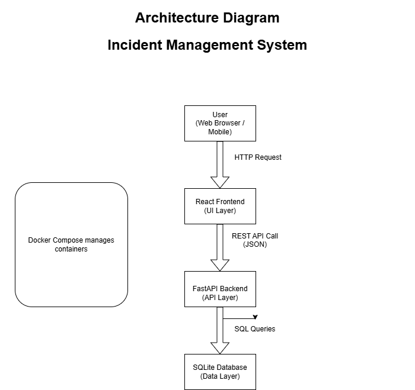
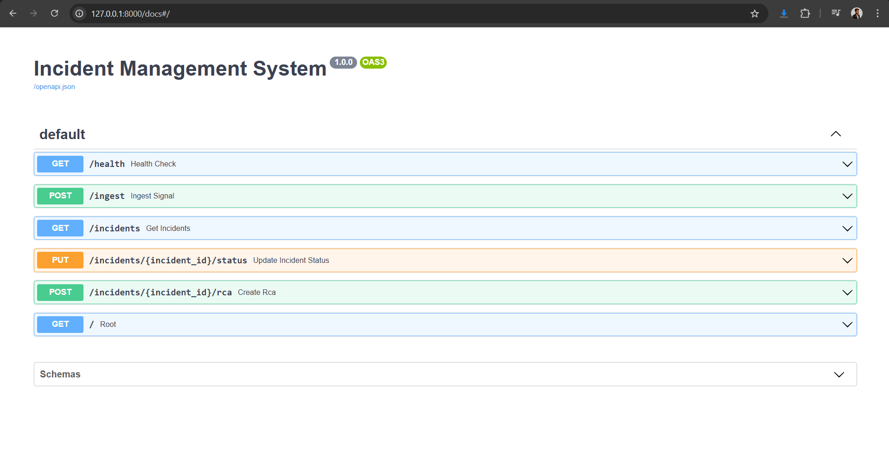
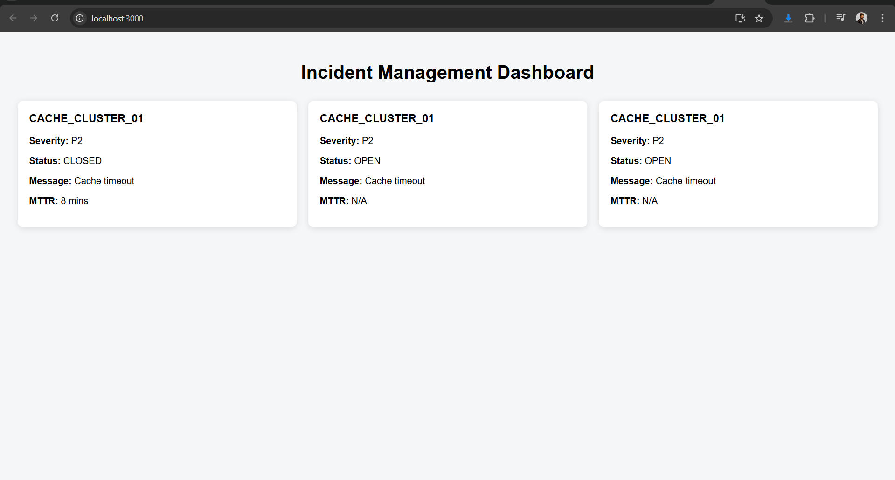
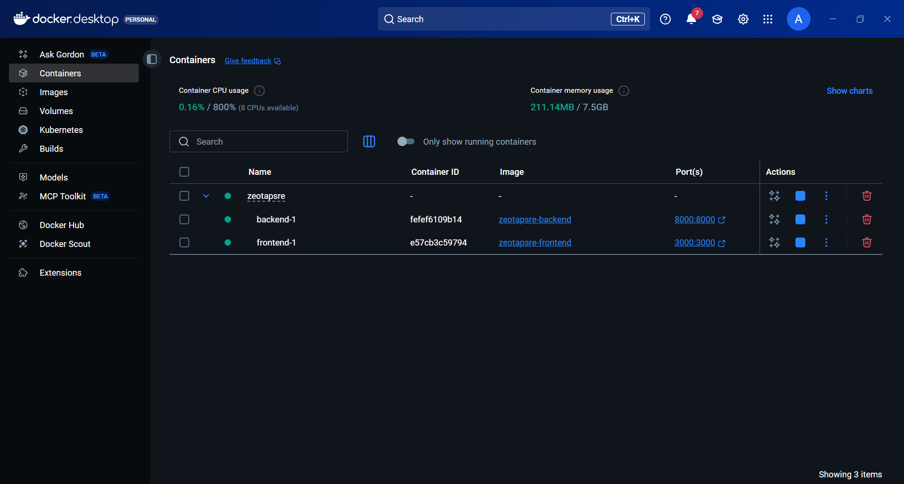

# Incident Management System (IMS)

A lightweight Incident Management System built for the Zeotap Infrastructure / SRE Internship Assignment.

---

# Features

- Incident ingestion API
- Incident tracking workflow
- Severity-based incidents
- RCA enforcement before closure
- MTTR calculation
- React dashboard
- Dockerized setup using Docker Compose

---

# Tech Stack

## Backend

- FastAPI
- SQLite
- SQLAlchemy
- Pydantic

## Frontend

- ReactJS

## DevOps

- Docker
- Docker Compose

---

# Architecture



---

# API Endpoints

| Method | Endpoint               | Description            |
| ------ | ---------------------- | ---------------------- |
| GET    | /health                | Health check           |
| POST   | /ingest                | Create incident        |
| GET    | /incidents             | List incidents         |
| PUT    | /incidents/{id}/status | Update incident status |

---

# Running Locally

## Backend

```bash
cd backend
pip install -r requirements.txt
uvicorn app.main:app --reload
```

## Frontend

```bash
cd frontend
npm install
npm start
```

---

# Running with Docker

```bash
docker compose up --build
```

Frontend:

```bash
http://localhost:3000
```

Backend:

```bash
http://localhost:8000/docs
```

---

# Screenshots

## Swagger API



---

## React Dashboard



---

## Docker Containers



---

# Key Functionalities

## Incident Lifecycle

- OPEN
- ACKNOWLEDGED
- CLOSED

## RCA Validation

Incidents with severity P1/P2 require RCA before closure.

## MTTR Calculation

System calculates Mean Time To Resolution automatically.

---

# Future Improvements

- Authentication
- Kubernetes deployment
- Redis caching
- Monitoring and alerting

---

# Author

Ashwath Amudhan C A
